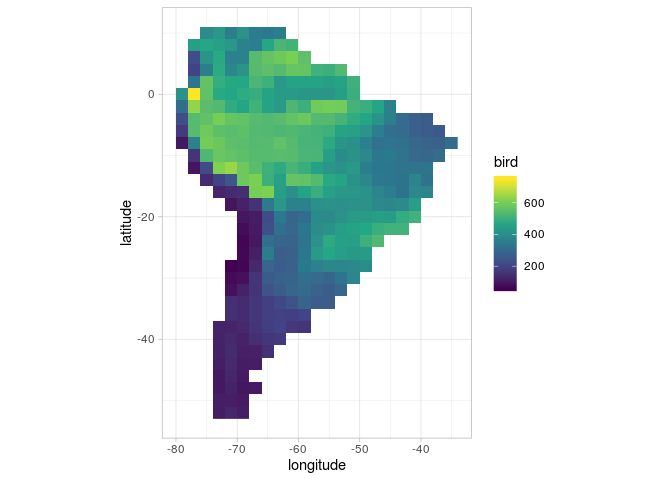

---
output:
 html_document:
   keep_md: true
---
Adapted from: https://stackoverflow.com/a/42934670


```r
# ipak function: install and load multiple R packages.
# Check to see if packages are installed. 
# Install them if they are not, then load them into the R session.
# Forked from: https://gist.github.com/stevenworthington/3178163
ipak <- function(pkg) {
  new.pkg <- pkg[!(pkg %in% installed.packages()[, "Package"])]
  if (length(new.pkg)){
    install.packages(new.pkg, dependencies = TRUE)
  }
  suppressPackageStartupMessages(sapply(pkg, require, character.only = TRUE))
}

ipak(
  c(
    "tidyverse", 
    "tidylog", 
    "gridExtra"
    )
  )
```

```
## tidyverse   tidylog gridExtra 
##      TRUE      TRUE      TRUE
```

```r
df <- tibble::tribble(
  ~longitude, ~latitude, ~bird, ~mammal, ~amphibiam,    ~aet,
         -79,        -8,    98,      44,          3,  22.612,
         -79,        -6,   176,      98,         12,   45.39,
         -79,        -4,   224,     121,         26,  79.282,
         -79,        -2,   307,     137,         50,  64.409,
         -79,         0,   412,     152,         74,  79.789,
         -77,       -12,    91,      31,          2,  24.101,
         -77,       -10,   159,      86,         10,  43.153,
         -77,        -8,   364,     159,          8,  75.343,
         -77,        -6,   538,     192,         79,  94.267,
         -77,        -4,   538,     202,         97, 141.197,
         -77,        -2,   634,     201,        123, 133.831,
         -77,         0,   750,     218,        149,  100.21,
         -77,         2,   328,     177,         64,  78.984,
         -77,         4,   197,     140,         45, 114.974,
         -77,         6,   221,     137,         33, 130.104,
         -77,         8,   446,     170,         67, 121.386,
         -75,       -14,   140,      31,          3,  25.558,
         -75,       -12,   218,     105,         10,  54.831,
         -75,       -10,   526,     190,         42, 108.548,
         -75,        -8,   597,     219,        112, 119.145,
         -75,        -6,   586,     207,        120, 131.091,
         -75,        -4,   559,     193,        111, 134.029,
         -75,        -2,   546,     194,        123, 119.864,
         -75,         0,   559,     193,        107, 116.629,
         -75,         2,   564,     186,         62,  96.903,
         -75,         4,   357,     182,         31,  86.261,
         -75,         6,   419,     171,        103,  96.423,
         -75,         8,   472,     175,         63, 113.955,
         -75,        10,   395,     162,         24,  88.816,
         -73,       -52,   104,      14,          1,  39.622,
         -73,       -50,   107,      23,          2,  32.837,
         -73,       -48,    98,      21,          2,  36.419,
         -73,       -46,    95,      13,          5,  50.777,
         -73,       -44,   108,      15,          8,  44.717,
         -73,       -42,   114,      22,          8,  49.704,
         -73,       -40,   117,      26,          7,  49.057,
         -73,       -38,   121,      27,         10,  45.442,
         -73,       -16,   124,      26,          2,  14.033,
         -73,       -14,   196,      87,          5,   41.14,
         -73,       -12,   617,     202,         29,  81.694,
         -73,       -10,   576,     216,        112,  115.39,
         -73,        -8,   581,     194,        125, 111.981,
         -73,        -6,   554,     191,        113, 124.745,
         -73,        -4,   601,     190,        129, 130.137,
         -73,        -2,   532,     187,        113, 128.083,
         -73,         0,   479,     167,         81, 103.736,
         -73,         2,   490,     175,         48,  74.671,
         -73,         4,   482,     184,         49, 109.631,
         -73,         6,   479,     194,         54,  75.472,
         -73,         8,   454,     181,         46, 104.545,
         -73,        10,   425,     174,         26, 100.928,
         -71,       -52,   127,      25,          1,  30.431,
         -71,       -50,   107,      24,          1,  24.499,
         -71,       -48,   119,      28,          1,  16.028,
         -71,       -46,   126,      33,          2,  26.565,
         -71,       -44,   132,      32,          3,  25.746,
         -71,       -42,   139,      35,          6,  39.076,
         -71,       -40,   131,      44,          5,  37.024,
         -71,       -38,   121,      42,          6,  35.517,
         -71,       -36,   145,      31,          6,  32.023,
         -71,       -34,   147,      27,          4,  26.016,
         -71,       -32,    84,      12,          2,  17.601,
         -71,       -30,    73,      16,          0,   7.849,
         -71,       -28,    61,      13,          1,   5.286,
         -71,       -18,    90,      16,          0,   5.906,
         -71,       -16,   136,      58,          3,  27.997,
         -71,       -14,   248,     147,         12,  51.194,
         -71,       -12,   642,     228,        113, 131.812,
         -71,       -10,   561,     196,        111, 117.518,
         -71,        -8,   551,     188,        115, 110.825,
         -71,        -6,   544,     182,        106, 121.638,
         -71,        -4,   570,     186,        121, 120.493,
         -71,        -2,   487,     178,        100, 121.229,
         -71,         0,   468,     167,         73, 118.335,
         -71,         2,   477,     155,         53, 109.394,
         -71,         4,   381,     169,         38, 113.838,
         -71,         6,   366,     150,         35, 115.178,
         -71,         8,   428,     195,         37,  94.255,
         -71,        10,   357,     178,         27,  68.219,
         -69,       -52,   107,      11,          0,  21.887,
         -69,       -50,   101,      19,          1,  15.775,
         -69,       -48,    94,      23,          1,  12.669,
         -69,       -46,   102,      25,          1,  11.462,
         -69,       -44,   104,      26,          2,  17.168,
         -69,       -42,   110,      30,          2,  23.863,
         -69,       -40,   117,      33,          3,  18.566,
         -69,       -38,   130,      31,          3,  20.884,
         -69,       -36,   138,      29,          3,  25.573,
         -69,       -34,   136,      36,          3,  25.384,
         -69,       -32,   116,      34,          3,  14.721,
         -69,       -30,    83,      34,          1,  10.379,
         -69,       -28,    67,      24,          1,   8.188,
         -69,       -26,    68,      20,          1,   5.312,
         -69,       -24,    67,      15,          0,   3.039,
         -69,       -22,    76,      17,          0,   2.826,
         -69,       -20,    94,      32,          1,   6.119,
         -69,       -18,   119,      47,          4,  23.186,
         -69,       -16,   143,      95,         16,  50.035,
         -69,       -14,   583,     197,         41,  89.176,
         -69,       -12,   584,     208,         92, 118.646,
         -69,       -10,   552,     185,        101, 110.769,
         -69,        -8,   544,     178,        107, 111.025,
         -69,        -6,   552,     182,        105, 118.292,
         -69,        -4,   562,     179,        112, 116.853,
         -69,        -2,   467,     179,         97, 121.127,
         -69,         0,   484,     164,         72, 121.459,
         -69,         2,   472,     153,         62, 124.612,
         -69,         4,   419,     157,         40,  124.94,
         -69,         6,   367,     167,         30, 109.069,
         -69,         8,   363,     172,         24, 100.844,
         -69,        10,   410,     175,         33,  81.289,
         -67,       -48,    99,      18,          1,  15.948,
         -67,       -44,   107,      25,          2,  16.037,
         -67,       -42,   114,      30,          3,  16.469,
         -67,       -40,   148,      30,          3,  19.992,
         -67,       -38,   162,      31,          4,  28.858,
         -67,       -36,   166,      32,          4,  40.193,
         -67,       -34,   168,      39,          4,  34.731,
         -67,       -32,   162,      45,          6,  31.416,
         -67,       -30,   160,      53,          4,  27.453,
         -67,       -28,   129,      52,          3,  27.047,
         -67,       -26,   109,      46,          1,  29.715,
         -67,       -24,    98,      42,          1,   28.13,
         -67,       -22,   102,      34,          4,  18.849,
         -67,       -20,   106,      38,          3,  18.811,
         -67,       -18,   155,      68,          7,  35.784,
         -67,       -16,   604,     176,         28,  92.572,
         -67,       -14,   607,     182,         75, 121.159,
         -67,       -12,   544,     169,         82, 109.245,
         -67,       -10,   537,     174,         98, 112.192,
         -67,        -8,   535,     173,        104, 116.319,
         -67,        -6,   533,     175,        101, 117.953,
         -67,        -4,   537,     176,        103, 119.334,
         -67,        -2,   505,     178,         91, 123.135,
         -67,         0,   493,     174,         77, 121.802,
         -67,         2,   520,     190,         72, 139.189,
         -67,         4,   538,     189,         52, 110.832,
         -67,         6,   537,     178,         43,  84.441,
         -67,         8,   353,     175,         27,  89.229,
         -67,        10,   352,     162,         35,  83.407,
         -65,       -42,   150,      23,          3,  17.883,
         -65,       -40,   164,      27,          5,  26.062,
         -65,       -38,   182,      33,          6,  40.781,
         -65,       -36,   185,      37,          8,  50.567,
         -65,       -34,   188,      43,          8,  54.407,
         -65,       -32,   237,      52,         13,  54.484,
         -65,       -30,   260,      51,         17,  49.502,
         -65,       -28,   286,      63,         14,  55.631,
         -65,       -26,   347,      89,         16,  54.291,
         -65,       -24,   310,      98,         19,  50.364,
         -65,       -22,   231,     104,         11,  50.432,
         -65,       -20,   219,      92,         13,  42.554,
         -65,       -18,   346,     141,         25,  65.635,
         -65,       -16,   613,     186,         77, 128.058,
         -65,       -14,   500,     172,         71, 113.649,
         -65,       -12,   503,     165,         78, 106.261,
         -65,       -10,   537,     160,        102, 108.692,
         -65,        -8,   538,     166,         95, 114.175,
         -65,        -6,   531,     170,         98, 120.457,
         -65,        -4,   532,     178,         94, 124.648,
         -65,        -2,   457,     173,         87, 125.767,
         -65,         0,   461,     176,         75, 123.457,
         -65,         2,   502,     191,         68, 120.207,
         -65,         4,   549,     198,         57,  89.672,
         -65,         6,   566,     183,         39,  89.701,
         -65,         8,   476,     182,         37,  93.691,
         -65,        10,   339,     160,         22,  79.318,
         -63,       -40,   171,      21,          5,  34.459,
         -63,       -38,   195,      34,          7,  51.402,
         -63,       -36,   190,      38,         11,  60.459,
         -63,       -34,   210,      42,         12,  64.388,
         -63,       -32,   261,      45,         13,  65.699,
         -63,       -30,   277,      45,         16,  65.166,
         -63,       -28,   265,      53,         20,  56.298,
         -63,       -26,   267,      67,         25,  57.388,
         -63,       -24,   289,      82,         31,    59.3,
         -63,       -22,   315,     112,         31,  66.218,
         -63,       -20,   340,     128,         26,  62.184,
         -63,       -18,   426,     150,         37,  88.676,
         -63,       -16,   449,     170,         68,  96.133,
         -63,       -14,   456,     171,         69, 103.175,
         -63,       -12,   483,     157,         84, 101.842,
         -63,       -10,   542,     145,         99, 105.801,
         -63,        -8,   558,     162,         97, 110.093,
         -63,        -6,   522,     168,         92, 120.789,
         -63,        -4,   541,     180,         92, 127.416,
         -63,        -2,   435,     167,         86, 128.961,
         -63,         0,   437,     169,         74, 125.951,
         -63,         2,   428,     182,         67, 110.917,
         -63,         4,   535,     193,         41,  96.255,
         -63,         6,   585,     190,         37,  94.294,
         -63,         8,   520,     184,         41,  92.728,
         -63,        10,   353,     163,         28, 102.451,
         -61,       -38,   167,      33,          8,  56.049,
         -61,       -36,   189,      39,          9,  62.974,
         -61,       -34,   237,      42,         11,  65.411,
         -61,       -32,   286,      49,         21,  69.314,
         -61,       -30,   284,      48,         27,  72.752,
         -61,       -28,   276,      55,         28,  74.649,
         -61,       -26,   277,      74,         32,  69.965,
         -61,       -24,   284,      91,         34,  65.483,
         -61,       -22,   291,     106,         31,  59.066,
         -61,       -20,   286,     108,         33,  62.694,
         -61,       -18,   363,     132,         43,  86.912,
         -61,       -16,   403,     158,         54,  95.306,
         -61,       -14,   566,     168,         74,  90.458,
         -61,       -12,   514,     141,         84,  81.707,
         -61,       -10,   539,     142,         90,  97.127,
         -61,        -8,   535,     157,         87, 114.963,
         -61,        -6,   528,     159,         87, 126.942,
         -61,        -4,   563,     168,         92, 127.174,
         -61,        -2,   524,     176,         85, 127.716,
         -61,         0,   434,     169,         75, 124.757,
         -61,         2,   462,     180,         75,  99.502,
         -61,         4,   570,     186,         58,  92.261,
         -61,         6,   606,     198,         75,  90.774,
         -61,         8,   508,     175,         56, 111.479,
         -59,       -38,   161,      31,          8,  58.525,
         -59,       -36,   201,      37,         10,  63.033,
         -59,       -34,   283,      51,         20,  67.893,
         -59,       -32,   301,      49,         25,  70.167,
         -59,       -30,   312,      58,         36,  77.044,
         -59,       -28,   342,      78,         45,  82.453,
         -59,       -26,   332,      97,         36,  86.208,
         -59,       -24,   325,     107,         33,  83.336,
         -59,       -22,   330,     107,         35,  83.984,
         -59,       -20,   307,     108,         39,  82.634,
         -59,       -18,   364,     122,         44,  90.923,
         -59,       -16,   457,     146,         48,  93.998,
         -59,       -14,   562,     146,         52,  80.601,
         -59,       -12,   495,     138,         69,  82.186,
         -59,       -10,   519,     136,         78,  96.839,
         -59,        -8,   516,     152,         77, 116.676,
         -59,        -6,   518,     158,         82, 122.541,
         -59,        -4,   579,     169,         86, 126.676,
         -59,        -2,   499,     174,         84, 126.207,
         -59,         0,   424,     164,         75, 123.528,
         -59,         2,   460,     183,         72, 100.079,
         -59,         4,   567,     186,         74, 106.355,
         -59,         6,   555,     188,         71, 119.854,
         -57,       -34,   264,      50,         21,  66.581,
         -57,       -32,   281,      54,         22,  68.368,
         -57,       -30,   301,      68,         31,  76.297,
         -57,       -28,   363,      84,         36,  84.037,
         -57,       -26,   431,     114,         38,  92.586,
         -57,       -24,   410,     113,         40,  97.356,
         -57,       -22,   396,     111,         44,  97.897,
         -57,       -20,   391,     118,         46,  94.019,
         -57,       -18,   403,     123,         50,  94.704,
         -57,       -16,   496,     134,         45,  96.388,
         -57,       -14,   535,     133,         48,  88.632,
         -57,       -12,   453,     128,         60,    88.4,
         -57,       -10,   517,     126,         72,  99.539,
         -57,        -8,   513,     140,         73, 106.638,
         -57,        -6,   510,     152,         77, 119.355,
         -57,        -4,   533,     166,         79, 125.866,
         -57,        -2,   591,     182,         85, 126.496,
         -57,         0,   427,     162,         79, 120.331,
         -57,         2,   461,     184,         79, 110.016,
         -57,         4,   505,     191,         87,  119.97,
         -55,       -34,   261,      50,         18,  65.165,
         -55,       -32,   264,      57,         26,  67.459,
         -55,       -30,   285,      65,         36,  73.902,
         -55,       -28,   378,      96,         40,  78.326,
         -55,       -26,   472,     115,         37,  81.403,
         -55,       -24,   483,     114,         41,  89.391,
         -55,       -22,   415,     112,         42,  96.066,
         -55,       -20,   391,     118,         45, 100.442,
         -55,       -18,   408,     124,         49, 105.247,
         -55,       -16,   458,     129,         48,  91.657,
         -55,       -14,   479,     131,         44,  86.162,
         -55,       -12,   424,     125,         48,  92.487,
         -55,       -10,   448,     124,         64,  95.862,
         -55,        -8,   481,     135,         69,  95.684,
         -55,        -6,   502,     148,         72, 107.586,
         -55,        -4,   535,     167,         77, 112.162,
         -55,        -2,   599,     173,         86, 106.394,
         -55,         0,   421,     164,         78, 105.489,
         -55,         2,   447,     186,         85, 112.239,
         -55,         4,   499,     185,         87,  119.65,
         -53,       -32,   290,      67,         27,  67.733,
         -53,       -30,   328,      75,         36,  74.442,
         -53,       -28,   376,      98,         44,  71.117,
         -53,       -26,   443,     114,         47,  68.254,
         -53,       -24,   453,     115,         41,  79.661,
         -53,       -22,   444,     114,         41,  89.749,
         -53,       -20,   408,     119,         43,  93.565,
         -53,       -18,   405,     121,         40,  91.059,
         -53,       -16,   428,     125,         44,  82.903,
         -53,       -14,   460,     129,         43,  83.588,
         -53,       -12,   412,     126,         44,  94.719,
         -53,       -10,   392,     127,         59,  94.353,
         -53,        -8,   418,     134,         65,  93.262,
         -53,        -6,   459,     144,         71,  99.213,
         -53,        -4,   513,     163,         73, 106.058,
         -53,        -2,   593,     178,         75, 104.133,
         -53,         0,   449,     169,         79, 106.892,
         -53,         2,   457,     177,         87, 108.474,
         -53,         4,   530,     180,         99, 118.572,
         -51,       -30,   378,      85,         40,  70.983,
         -51,       -28,   387,     107,         45,  63.321,
         -51,       -26,   432,     118,         48,  64.318,
         -51,       -24,   450,     117,         46,   76.13,
         -51,       -22,   457,     126,         44,  87.926,
         -51,       -20,   438,     125,         40,  88.919,
         -51,       -18,   411,     123,         42,  85.079,
         -51,       -16,   425,     127,         47,    83.6,
         -51,       -14,   415,     128,         49,  86.587,
         -51,       -12,   434,     128,         46,  84.654,
         -51,       -10,   408,     129,         44,  88.203,
         -51,        -8,   407,     134,         60,  76.669,
         -51,        -6,   455,     146,         66,  86.808,
         -51,        -4,   487,     161,         71, 100.461,
         -51,        -2,   510,     168,         71, 117.496,
         -51,         0,   496,     165,         73, 116.875,
         -51,         2,   502,     174,         81, 113.205,
         -49,       -28,   398,     102,         61,  71.371,
         -49,       -26,   439,     117,         71,  72.405,
         -49,       -24,   498,     138,         76,  75.298,
         -49,       -22,   475,     146,         51,  83.278,
         -49,       -20,   436,     134,         45,  85.183,
         -49,       -18,   408,     129,         51,  80.934,
         -49,       -16,   411,     127,         53,  75.396,
         -49,       -14,   379,     123,         53,  78.631,
         -49,       -12,   358,     128,         48,  80.736,
         -49,       -10,   382,     126,         46,  89.524,
         -49,        -8,   360,     132,         38,   90.02,
         -49,        -6,   414,     146,         55,  87.071,
         -49,        -4,   465,     155,         64,  98.559,
         -49,        -2,   496,     166,         64, 115.926,
         -47,       -24,   529,     144,         96,   76.21,
         -47,       -22,   496,     157,         71,  77.514,
         -47,       -20,   446,     141,         53,  76.877,
         -47,       -18,   386,     130,         55,  77.599,
         -47,       -16,   375,     127,         58,  75.216,
         -47,       -14,   339,     128,         53,  75.206,
         -47,       -12,   335,     124,         46,  77.351,
         -47,       -10,   330,     124,         48,  82.212,
         -47,        -8,   317,     126,         41,  83.936,
         -47,        -6,   354,     130,         33,  81.731,
         -47,        -4,   411,     146,         46,  89.808,
         -47,        -2,   465,     155,         55, 102.584,
         -45,       -22,   506,     156,        109,  70.794,
         -45,       -20,   441,     150,         61,  76.388,
         -45,       -18,   377,     136,         51,  73.311,
         -45,       -16,   355,     130,         47,  66.891,
         -45,       -14,   330,     129,         43,  65.828,
         -45,       -12,   331,     123,         39,  68.758,
         -45,       -10,   342,     127,         35,  68.027,
         -45,        -8,   326,     124,         36,  74.116,
         -45,        -6,   312,     124,         33,  75.369,
         -45,        -4,   360,     127,         34,  87.351,
         -45,        -2,   366,     126,         32,  96.424,
         -43,       -22,   507,     144,        110,  80.196,
         -43,       -20,   488,     156,         84,  76.139,
         -43,       -18,   388,     151,         59,  65.906,
         -43,       -16,   324,     135,         50,  58.303,
         -43,       -14,   324,     131,         46,  55.179,
         -43,       -12,   325,     130,         33,  54.417,
         -43,       -10,   322,     135,         32,  52.603,
         -43,        -8,   319,     129,         29,  61.481,
         -43,        -6,   305,     125,         32,  74.436,
         -43,        -4,   301,     123,         34,  82.113,
         -41,       -20,   504,     147,         98,  81.005,
         -41,       -18,   444,     151,         73,  77.296,
         -41,       -16,   384,     143,         56,   60.68,
         -41,       -14,   371,     134,         43,    55.3,
         -41,       -12,   322,     129,         42,  56.375,
         -41,       -10,   297,     133,         34,  41.328,
         -41,        -8,   293,     134,         32,  45.987,
         -41,        -6,   275,     125,         30,  52.506,
         -41,        -4,   276,     123,         30,  61.835,
         -39,       -16,   371,     131,         71,  89.582,
         -39,       -14,   319,     128,         57,  94.219,
         -39,       -12,   325,     135,         58,  67.412,
         -39,       -10,   294,     137,         43,  44.148,
         -39,        -8,   279,     138,         35,  49.357,
         -39,        -6,   261,     126,         32,  55.845,
         -39,        -4,   262,     123,         28,  59.165,
         -37,       -10,   303,     131,         52,  62.352,
         -37,        -8,   277,     133,         43,  46.813,
         -37,        -6,   250,     122,         32,  51.643,
         -35,        -8,   301,     130,         41,  68.309
  )

df %>% 
  ggplot(aes(x = longitude, y = latitude)) +
  geom_raster(aes(fill = bird)) +
  scale_fill_viridis_c()
```

<!-- -->

```r
df %>% 
  pivot_longer(
    cols = -c("longitude", "latitude"), 
    names_to = "variable"
  ) %>% 
  ggplot(aes(x = longitude, y = latitude)) +
  geom_raster(aes(fill = value)) +
  scale_fill_viridis_c() +
  facet_wrap(~variable)
```

<!-- -->

```r
plot_func <- function(df, name) {
  ggplot(data = df, aes(x = longitude, y = latitude, fill = value)) +
    geom_tile() +
    scale_fill_viridis_c(name = name)
}

nested_tmp <- df %>% 
  pivot_longer(
    cols = -c("longitude", "latitude"), 
    names_to = "variable"
  ) %>% 
  group_by(variable) %>% 
  nest() %>% 
  mutate(plots = map2(data, variable, plot_func)) 
```

```
## group_by: one grouping variable (variable)
```

```
## mutate (grouped): new variable 'plots' with 4 unique values and 0% NA
```

```r
nested_tmp$plots
```

```
## [[1]]
```

<!-- -->

```
## 
## [[2]]
```

<!-- -->

```
## 
## [[3]]
```

<!-- -->

```
## 
## [[4]]
```

<!-- -->

```r
grid.arrange(grobs = nested_tmp$plots)
```

<!-- -->


---
title: "ggplot_geom_raster-and-facet_wrap-with-scale-free.R"
author: "karlo"
date: "2019-11-19"
---
